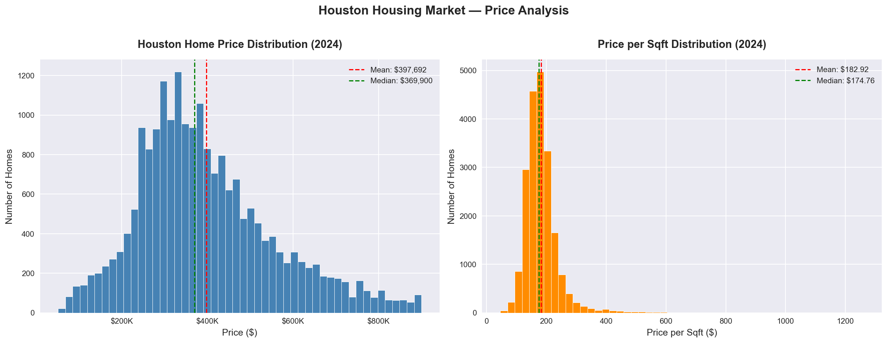
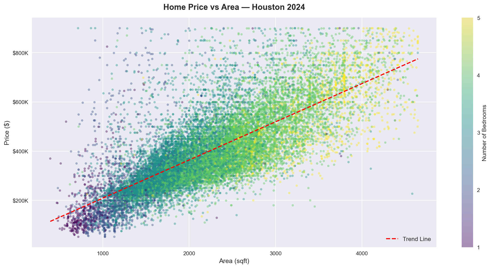
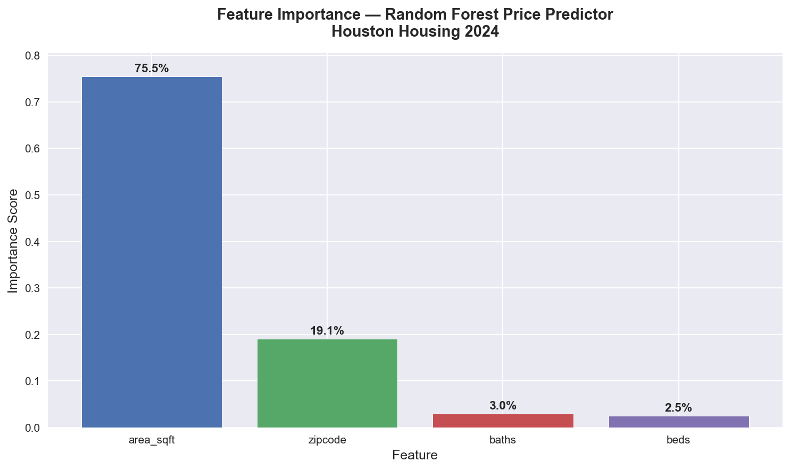
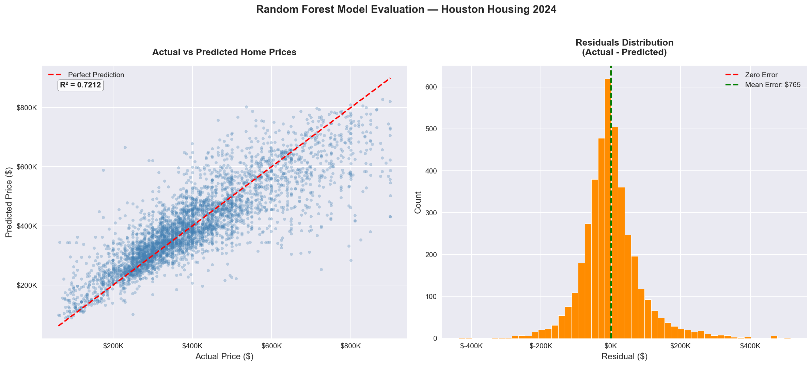

# Houston Housing Market Analysis 2024

## Project Overview
An end-to-end data science project analyzing the Houston housing market using real Zillow data from 2024. This project covers data cleaning, exploratory data analysis, visualization, and machine learning price prediction.

## Dataset
- **Source:** Zillow Houston Housing Market 2024 (Kaggle)
- **Size:** 25,948 raw listings → 20,558 after cleaning
- **Features:** Price, bedrooms, bathrooms, area, zipcode, zestimate

## Project Structure
    houston-housing-analysis/
    ├── data/                            # Raw data (not tracked by git)
    ├── notebooks/
    │   └── analysis.ipynb               # Main analysis notebook
    ├── visuals/                         # All generated charts
    ├── models/
    │   └── houston_price_predictor.pkl  # Trained Random Forest model
    └── README.md

## Methodology

### 1. Data Cleaning
- Selected 8 relevant features from 58 raw columns
- Handled missing values: median imputation for zestimate, Unknown for broker
- Removed outliers using IQR method combined with domain knowledge

### 2. Exploratory Data Analysis
- Analyzed price distribution across 20,558 listings
- Investigated relationships between price, size, bedrooms, and location
- Identified pricing patterns across Houston zipcodes

### 3. Machine Learning Model
- **Algorithm:** Random Forest Regressor
- **Features:** beds, baths, area_sqft, zipcode
- **Train/Test Split:** 80/20
- **Note:** Intentionally excluded zestimate and price_per_sqft to avoid data leakage

## Key Findings
| Insight | Value |
|---|---|
| Median home price | $369,900 |
| Average price per sqft | $174.76 |
| Most affordable zipcode | 77036 |
| Most expensive zipcode | 77098 |
| Most common home type | 4 bed / 3 bath / 2,217 sqft |
| Strongest price predictor | Area sqft — 75.5% importance |

## Model Performance
| Metric | Value |
|---|---|
| R² Score | 0.7212 |
| RMSE | $84,725 |
| MAE | $58,519 |
| Avg % Error | 14.6% |

## Visualizations
### Price Distribution

### Price vs Area

### Feature Importance

### Model Evaluation

## Technologies Used
- **Python 3.x**
- **Pandas & NumPy** — data manipulation
- **Matplotlib & Seaborn** — visualizations
- **Scikit-learn** — machine learning
- **Joblib** — model persistence

## Author
**Rohith Phani Gavirneni**
M.S. Engineering Data Science — University of Houston
[LinkedIn](https://www.linkedin.com/in/rohith-phani-2aba50186/) | [GitHub](https://github.com/rohithphani)
